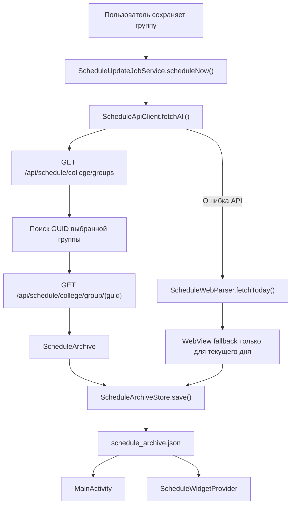

# Архитектура ScheduleWidget

Документ описывает состояние ветки `codex/offline-schedule-widget-days`.
Текущая версия приложения: `2.3` (`versionCode = 13`).

## Назначение

ScheduleWidget — Android-приложение с домашним виджетом расписания колледжа.
Приложение напрямую получает данные с `rasp.ural-campus.ru`, сохраняет их во внутренний JSON-архив и позволяет открывать сохраненные дни без интернета.

Основные возможности:

- выбор группы;
- загрузка опубликованного расписания;
- автоматическое обновление около `01:00`;
- локальный офлайн-архив;
- выбор даты в приложении;
- выбор дня и перелистывание недель прямо в виджете;
- изменение высоты виджета с адаптивным количеством карточек;
- сохранение точного времени пар в формате `HH:mm`, например `10:10–11:40`.

## Поток данных



## Источник расписания

Основной источник данных — API сайта:

```text
https://rasp.ural-campus.ru/api
```

Используются два endpoint:

```text
GET /schedule/college/groups
GET /schedule/college/group/{guid}?datebegin=dd-MM-yyyy&dateend=dd-MM-yyyy
```

Класс [`ScheduleApiClient`](../app/src/main/java/com/kirix/schedule/ScheduleApiClient.java):

1. получает список групп;
2. нормализует введенное имя группы;
3. находит точное совпадение или подходящую запись, например `П-210` внутри `П-210, П-210А`;
4. запрашивает диапазон от семи дней назад до года вперед;
5. сохраняет только фактически опубликованный диапазон;
6. добавляет пустые записи для дней без занятий внутри опубликованного диапазона.

Если API недоступен, [`ScheduleWebParser`](../app/src/main/java/com/kirix/schedule/ScheduleWebParser.java) запускает скрытый `WebView` и пытается получить сегодняшний день через страницу сайта. Это резервный вариант: он не заменяет полный API-архив.

## Формат времени

API может возвращать время как `HH:mm` или `HH:mm:ss`.

Метод `trimSeconds()`:

- оставляет `11:40` без изменений;
- преобразует `11:40:00` в `11:40`.

Ранее метод ошибочно считал минуты секундами и преобразовывал `11:40` в `11`. Исправление находится в [`ScheduleApiClient`](../app/src/main/java/com/kirix/schedule/ScheduleApiClient.java).

## Локальный офлайн-архив

Архив хранится во внутреннем каталоге приложения:

```text
files/schedule_archive.json
```

Запись выполняется через `AtomicFile`, чтобы не оставить поврежденный JSON при прерывании операции.

Упрощенная структура:

```json
{
  "group": "П-210, П-210А",
  "dateBegin": "2026-05-24",
  "dateEnd": "2026-06-26",
  "updatedAtMillis": 1780246800000,
  "days": [
    {
      "group": "П-210, П-210А",
      "dateKey": "2026-06-01",
      "dayName": "ПН",
      "lessons": [
        {
          "number": "2 пара",
          "time": "10:10-11:40",
          "subject": "Основы проектирования баз данных",
          "teacher": "Мусин А.Р.",
          "room": "404, Комаровского 9А"
        }
      ],
      "updatedAtMillis": 1780246800000
    }
  ]
}
```

Классы:

- [`ScheduleArchive`](../app/src/main/java/com/kirix/schedule/ScheduleArchive.java) — модель полного архива и объединение исторических дней;
- [`ScheduleArchiveStore`](../app/src/main/java/com/kirix/schedule/ScheduleArchiveStore.java) — чтение и атомарная запись JSON;
- [`ScheduleData`](../app/src/main/java/com/kirix/schedule/ScheduleData.java) — расписание одного дня и список пар.

При успешном обновлении:

- свежий опубликованный диапазон заменяет старые данные этого диапазона;
- прошлые дни, которые уже вышли за пределы свежего диапазона, остаются в архиве;
- при смене группы архив предыдущей группы не используется.

Для совместимости со старыми версиями приложение умеет прочитать прежнее значение `last_json` из `SharedPreferences` и преобразовать его в архив из одного дня.

## Настройки приложения

[`SchedulePrefs`](../app/src/main/java/com/kirix/schedule/SchedulePrefs.java) хранит:

| Ключ | Назначение |
| --- | --- |
| `group` | выбранная группа |
| `last_json` | устаревший cache одного дня для миграции и WebView fallback |
| `last_error` | последняя ошибка обновления |
| `selected_date` | выбранная дата на экране приложения |
| `widget_selected_date` | выбранная дата домашнего виджета |

Дата приложения и дата виджета разделены намеренно: просмотр другого дня в приложении не должен неожиданно менять домашний экран.

## Фоновое обновление

[`ScheduleUpdateJobService`](../app/src/main/java/com/kirix/schedule/ScheduleUpdateJobService.java) использует Android `JobScheduler`.

Есть две задачи:

| ID | Назначение |
| --- | --- |
| `42100` | немедленное обновление после сохранения группы или системного обновления виджета |
| `42101` | ежедневное обновление около `01:00` по часовому поясу телефона |

Ежедневная задача:

1. рассчитывает задержку до ближайшего `01:00`;
2. требует доступную сеть;
3. сохраняется после перезагрузки телефона;
4. после завершения планирует следующий запуск;
5. возвращает выбранную дату виджета на сегодняшний день.

`JobScheduler` не гарантирует запуск ровно в `01:00`: Android может немного сдвинуть задачу для экономии батареи или до появления сети. Допустимое окно deadline сейчас составляет 15 минут после расчетного времени.

После `BOOT_COMPLETED` и `MY_PACKAGE_REPLACED` задача планируется повторно.

## Домашний виджет

[`ScheduleWidgetProvider`](../app/src/main/java/com/kirix/schedule/ScheduleWidgetProvider.java) управляет отрисовкой и действиями виджета.

Разметка находится в [`widget_schedule.xml`](../app/src/main/res/layout/widget_schedule.xml).

### Полоска дней

Виджет показывает неделю `ПН–ВС`:

- выбранный день имеет синий фон;
- сегодняшний день имеет светло-синий фон, если он не выбран;
- нажатие на день читает данные из локального архива без сети;
- стрелки слева и справа листают недели;
- нажатие на свободную область виджета открывает приложение.

Broadcast actions:

| Action | Назначение |
| --- | --- |
| `ACTION_SELECT_DAY` | выбрать дату из полоски |
| `ACTION_SHIFT_WEEK` | перейти на соседнюю неделю |
| `ACTION_REFRESH` | показать cache и запросить фоновое обновление |

### Изменение размера

Параметры заданы в [`schedule_widget_info.xml`](../app/src/main/res/xml/schedule_widget_info.xml):

```text
minResizeHeight = 125dp
maxResizeHeight = 320dp
resizeMode = horizontal|vertical
```

При изменении размера launcher вызывает `onAppWidgetOptionsChanged()`. Виджет перерисовывается и показывает только целые карточки:

| Доступная высота | Количество карточек |
| --- | --- |
| менее `155dp` | 1 |
| `155–187dp` | 2 |
| `188–219dp` | 3 |
| от `220dp` | до 4 |

Для расчета используется максимум из `OPTION_APPWIDGET_MIN_HEIGHT` и `OPTION_APPWIDGET_MAX_HEIGHT`.
Некоторые launcher-ы после обновления расписания сообщают минимальную высоту одного из состояний экрана. Использование только `OPTION_APPWIDGET_MIN_HEIGHT` приводило к исчезновению всех карточек кроме первой.

## Экран приложения

[`MainActivity`](../app/src/main/java/com/kirix/schedule/MainActivity.java) позволяет:

- сохранить группу;
- немедленно запросить обновление;
- выбрать дату через `DatePickerDialog`;
- прочитать выбранный день из локального архива;
- увидеть дату последнего обновления и последнюю ошибку;
- добавить виджет на главный экран через `requestPinAppWidget()`.

## Android-компоненты

Компоненты зарегистрированы в [`AndroidManifest.xml`](../app/src/main/AndroidManifest.xml):

| Компонент | Назначение |
| --- | --- |
| `MainActivity` | экран настройки и просмотра cache |
| `ScheduleWidgetProvider` | домашний виджет и broadcast actions |
| `ScheduleUpdateJobService` | сетевое обновление в фоне |

Permissions:

```text
INTERNET
ACCESS_NETWORK_STATE
RECEIVE_BOOT_COMPLETED
```

## Сборка

Release APK:

```powershell
.\gradlew.bat :app:assembleRelease
```

Путь к APK:

```text
app/build/outputs/apk/release/app-release.apk
```

Release-вариант сейчас подписывается локальным debug keystore. Для публикации в магазине потребуется отдельный release keystore и безопасная передача секретов.

## Проверка перед отправкой

```powershell
.\gradlew.bat :app:assembleRelease :app:lintDebug
git diff --check
```

Ручной сценарий:

1. установить APK;
2. сохранить группу и дождаться загрузки;
3. включить авиарежим;
4. переключать дни и недели в виджете;
5. проверить пустой день и день с парами;
6. растянуть и уменьшить виджет;
7. обновить расписание и убедиться, что после перерисовки остаются все карточки, которые помещаются по высоте;
8. проверить время пары, например `10:10–11:40`.

## Ограничения

- виджет показывает максимум четыре пары;
- фактический запуск ежедневной синхронизации зависит от Android;
- WebView fallback сохраняет только сегодняшний день;
- разные launcher-ы могут округлять размеры виджета по своей сетке;
- архив хранится во внутреннем каталоге приложения и удаляется при очистке данных приложения.
